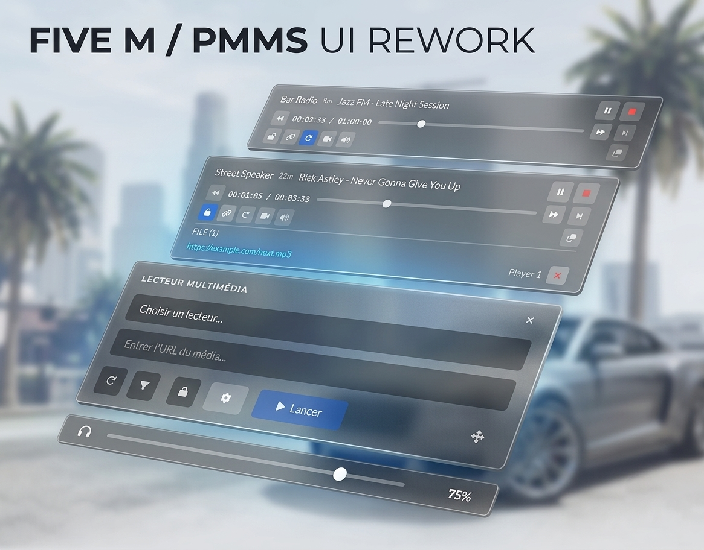
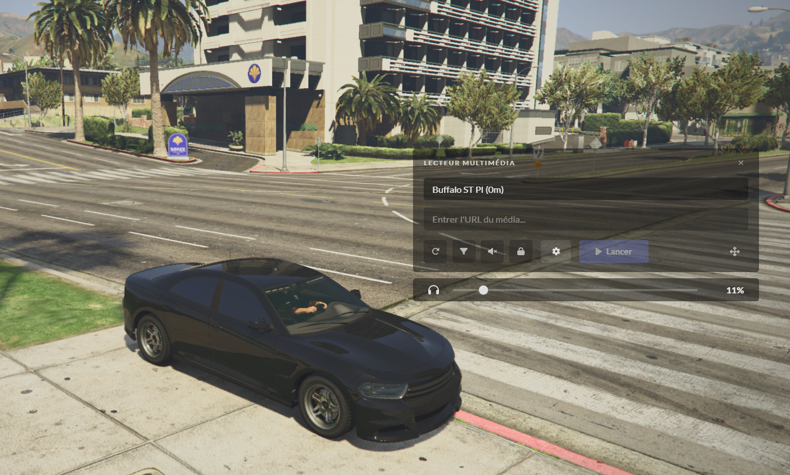
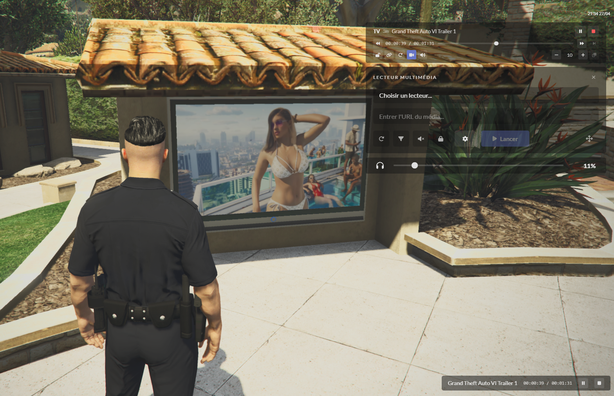

# PMMS UI

A Svelte interface rework for [PMMS](https://github.com/kibook/pmms), by [0xSacul](https://github.com/0xSacul).



This project replaces the interface of an existing PMMS resource. It is not a standalone FiveM resource; PMMS still supplies commands, permissions, media playback and scaleforms.

## Features

- Media playback controls, queue and movable interface.
- Advanced attenuation, range, video and scaleform settings.
- Player status bar and custom tooltips.
- English and French translations.
- Browser development mode with mock players.

<details>
<summary>In-game screenshots</summary>

### Vehicle media player



### TV playback



</details>

## Download and install

When a release is published, download **pmms-ui.zip** from [Releases](https://github.com/0xSacul/pmms-ui/releases). Use this asset for installation; GitHub's source archives contain development files.

1. Install [PMMS and its dependencies](https://github.com/kibook/pmms#installing) and back up its `ui/` folder.
2. Extract the ZIP and copy its four `ui/` files into PMMS's existing `ui/` folder.
3. Keep the original PMMS libraries and assets. Add `"ui/locale.json"` to the existing `files` block in `fxmanifest.lua`.
4. Restart PMMS and open it with `/pmms` or your configured command.

The ZIP includes [installation instructions](INSTALL.md), English/French translations and license notices. Sources, screenshots, development dependencies and PMMS's own libraries are excluded. No release has been published during preparation.

## Translation

English is enabled by default. To use French, copy `locales/fr.json` from the ZIP over the installed resource's `ui/locale.json`. Preserve your chosen translation when updating.

Create another translation from `locales/en.json`, editing values and keeping keys intact. Missing keys fall back to English. Tooltips accept plain strings or objects with `title` and `body`; backticks in structured tooltip bodies format inline code. Translation text is rendered as HTML, so use translations you trust.

## Develop and build

Use Node.js 24 (Node.js 22 or newer is required) and npm.

```sh
git clone https://github.com/0xSacul/pmms-ui.git
cd pmms-ui
npm ci
npm run dev
```

Open the local address printed by Vite. Browser mocks do not load PMMS's media libraries; test actual playback, DUI and scaleforms inside your PMMS resource.

```sh
npm test
npm run build
npm run package
```

`npm run build` generates the four UI replacement files in `dist/`. `npm run package` rebuilds, generates `artifacts/pmms-ui.zip` and its SHA-256 checksum, then verifies archive contents, runtime paths and translations. Apply your chosen translation after building: generated `locale.json` is always English.

Source components live in `src/components/`; NUI, tooltip, translation and media logic live in `src/lib/`. See [CONTRIBUTING.md](CONTRIBUTING.md).

## Meet FiveMesh

**Your FiveM infrastructure, in one place.**

Building a FiveM community? [FiveMesh](https://fivemesh.io) brings CDN, resource caching, managed voice and searchable logs into one platform. Host your images, videos and NUI assets, reduce repeated downloads from your FXServer, connect players with PMA-Voice-compatible voice, and find the server events that matter.

[Explore FiveMesh →](https://fivemesh.io)

## Credits and license

- [kibook/pmms](https://github.com/kibook/pmms): original resource and adapted media engine.
- [MediaElement.js](https://github.com/mediaelement/mediaelement) and [Wave.js](https://github.com/foobar404/Wave.js): runtime libraries provided by PMMS.
- [Svelte](https://svelte.dev/) and [Vite](https://vite.dev/): interface and builds.
- [Lato](https://fonts.google.com/specimen/Lato) and [Font Awesome](https://fontawesome.com/): remote font and icons.

Original contributions by 0xSacul are [MIT-licensed](LICENSE). The grant excludes inherited PMMS portions and third-party material; see [THIRD_PARTY_NOTICES.md](THIRD_PARTY_NOTICES.md). The inherited media engine's licensing remains to be clarified before public distribution of the repository or compiled UI.
